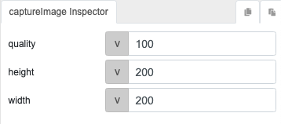
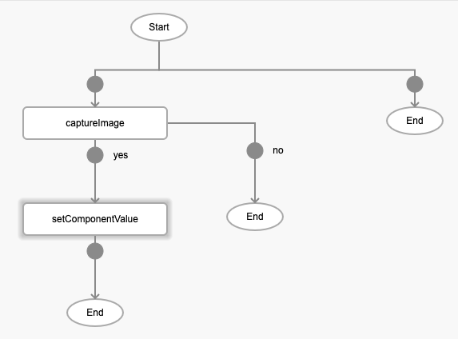

# captureImage

## Description

Activates the camera of the mobile device to capture image.

## Input / Parameter

| Name | Description | Input Type | Default | Options | Required |
| ------ | ------ | ------ | ------ | ------ | ------ |
| quality | The quality of the saved image. (Ranging from 0-100, where 100 is the full resolution.) | Number | - | - | Yes |
| height | The height to scale the image to, in pixels. | Number | - | - | Partial (Yes if 'width is provided'.) |
| width | The width to scale the image to, in pixels. | Number | - | - | Partial (Yes if 'height' is provided'.) |

## Output

N/A

## Callback

### callback

The function to be executed if the camera captures an image successfully.

### errorCallback

The function to be executed if the camera does not capture an image successfully.

## Video

Coming Soon.

<!-- Format:  -->

## Example

The user wants to take a photo using their mobile device and view the photo in the image component.

<!-- Share a scenario, like a user requirements. -->

### Steps

| No. | Description |  |
| ------ | ------ | ------ |
| 1. |  | Drag an image and a button component to a page in the mobile designer. |
| 2. |  | Select the event `click` for the button and drag the function `captureImage` to the event flow. |
| 3. |  | Fill in the parameters of the function. |
| 4. |  | Drag the the function to be executed if the image is captured successfully to the node below the function. In this example, we are using the `setComponentValue` to set the image to the image component. |
| 5. |  | Fill in the parameters of the function. |

### Result

The image captured will be shown in the image component.

<!-- Explain the output.

Format:  -->

## Links