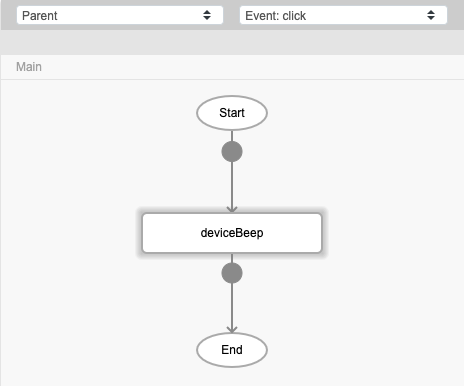
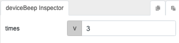

# deviceBeep

## Description

Activate the beep sound of mobile device.

## Input / Parameter

| Name | Description | Data Type | Default | Options | Required |
| ------ | ------ | ------ | ------ | ------ | ------ |
| times | The number of beeps. | Number | - | - | Yes |

## Output

N/A

## Callback

N/A

## Video

Coming Soon.

<!-- Format:  -->

## Example

The user wants to activate the beep sound in their mobile device.

<!-- Share a scenario, like a user requirements. -->

### Steps

| No. | Description |  |
| ------ | ------ | ------ |
| 1. |  |Drag a button to a page in the mobile designer. Select the event `click` for the button and drag the function `deviceBeep` to the event flow. |
| 2. |  | Fill in the parameter with the number of times the mobile should beep. |

<!-- Show the steps and share some screenshots.

1. .....

Format:  -->

### Result

When the button is pressed, the mobile device will beep 3 times.

<!-- Explain the output.

Format:  -->

## Links
