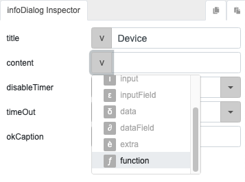
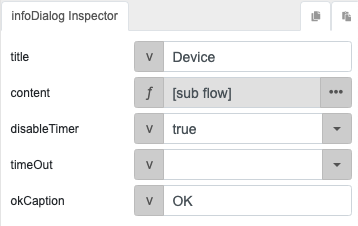

# deviceName

## Description

Get the name of a device.

## Input / Parameter

N/A

## Output

N/A

## Callback

N/A

## Video

Coming Soon.

<!-- Format:  -->

## Example

The user wants to display the device name in a dialog modal.

<!-- Share a scenario, like a user requirements. -->

### Steps

| No. | Description |  |
| ------ | ------ | ------ |
| 1. |  | Drag a button to a page in the mobile designer. Select the event `click` for the button and drag the `infoDialog` function to the event flow. Fill in the parameters of the function. For the parameter `content`, select the parameter type `function`. |
| 2. |  | Drag the `deviceName` function to the node in the subflow for the `content` parameter. |

<!-- Show the steps and share some screenshots.

1. .....

Format:  -->

### Result

When the button is pressed, the infoDialog will appear to show the device name.

<!-- Explain the output.

Format:  -->

## Links
