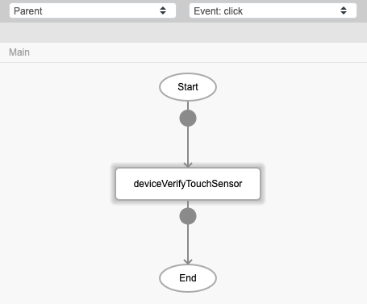
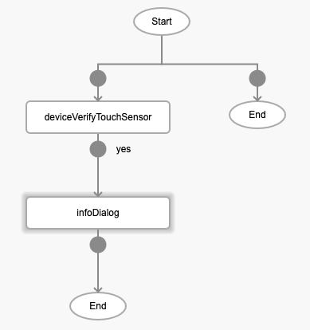
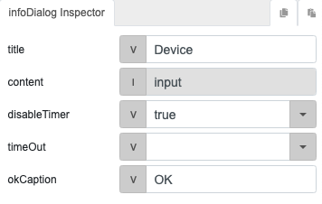

# deviceVerifyTouchSensor

## Description

Verifies the fingerprint that is stored in a user's mobile device.

## Input / Parameter

| Name | Description | Input Type | Default | Options | Required |
| ------ | ------ | ------ | ------ | ------ | ------ |
| key | The key in the device keychain. | String/Text | - | - | Yes |
| message | The message to display in the fingerprint dialog. | String/Text | - | - | Yes |

## Output

N/A

## Callback

### callback

The function to be be executed if the fingerprint is verified successfully.

## Video

Coming Soon.

<!-- Format:  -->

## Example

The user wants to verify the fingerprint stored in their device and display the password in the dialog box.

<!-- Share a scenario, like a user requirements. -->

### Steps

| No. | Description |  |
| ------ | ------ | ------ |
| 1. |  | Drag a button to a page in the mobile designer. Select the event `click` for the button and drag the function `deviceVerifyTouchSensor` to the event flow. |
| 2. |  | Fill in the parameters of the function. |
| 3. |  | Drag the function to be executed when the touch sensor is verified successfully. In this example, we are using the `infoDialog` function. |
| 4. |  | Fill in the parameters of the function. |

<!-- Show the steps and share some screenshots.

1. .....

Format:  -->

### Result

When the button is pressed, the mobile device will ask for fingerprint authentication with the message entered. Touch the touch sensor of the device for the fingerprint to be recognized. The dialog will appear to show the password.

<!-- Explain the output.

Format:  -->

## Links