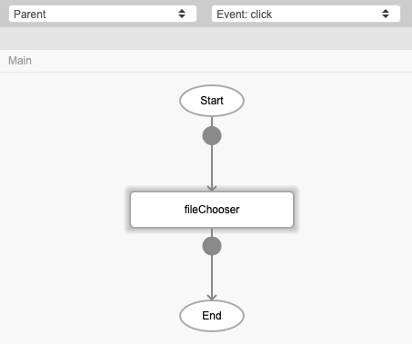
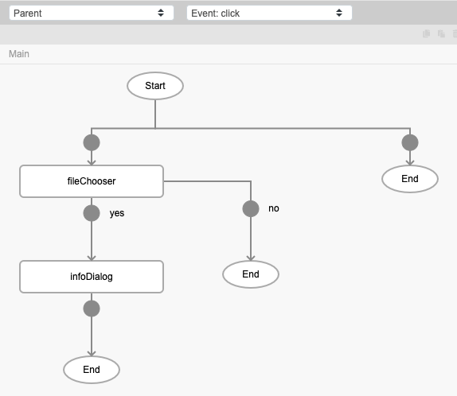
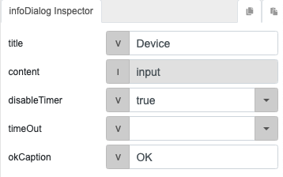

# fileChooser

## Description

Allows the user to choose multiple files.

## Input / Parameter

N/A

## Output

N/A

## Callback

### callback

The function to be executed if multiple files are chosen successfully.

### errorCallback

The function to be executed if multiple files are not chosen successfully.

## Video

Coming Soon.

## Example

The user wants to choose multiple files.

### Step

| No. | Description |  |
| ------ | ------ | ------ |
| 1. |  | Drag a button to a page in the mobile designer. Select the event `click` for the button and drag the function `fileChooser` to the event flow. |
| 2. |  | Drag the function to be executed when multiple files are chosen successfully. In this example, we are using the `infoDialog` function. |
| 3. |  | Fill in the parameters of the function. |
    
### Result?

When the button is pressed, the infoDialog will show the files chosen.

## Links