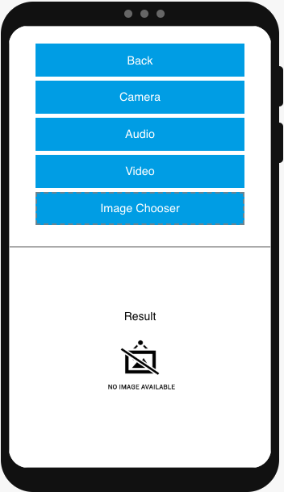
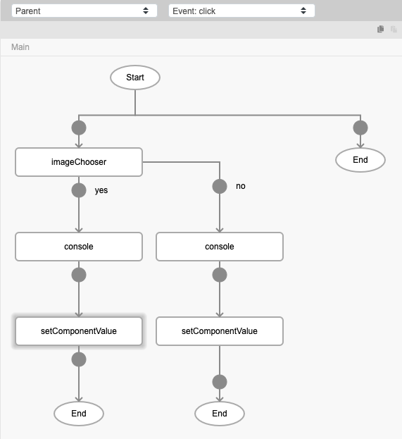
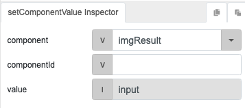
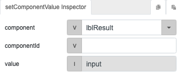
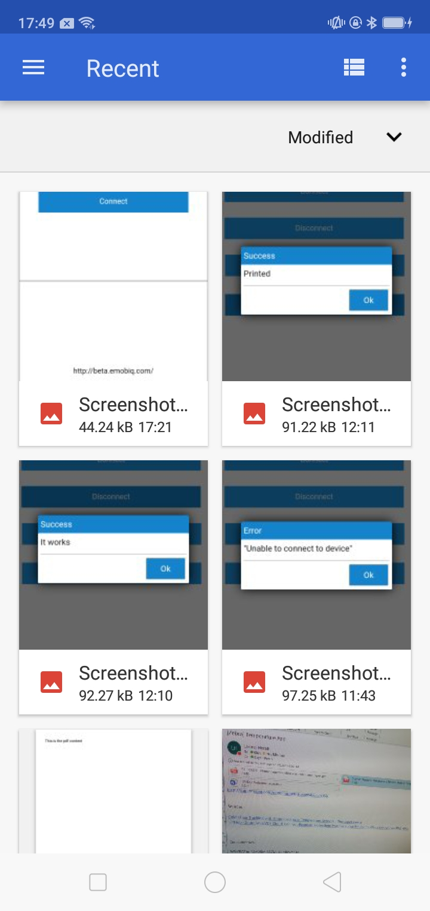

# imageChooser

## Description

Selects an image from user's phone storage.

## Input / Parameter

| Name | Description | Input Type | Default | Options | Required |
| ------ | ------ | ------ | ------ | ------ | ------ |
| multiple | The image(s) to choose. | Array/List | - | - | Yes |

## Output

N/A

## Callback

### callback

The setComponentValue function will be executed to show the image chosen in the image component if it exists.

### errorCallback

The function to be executed if the image component does not exist.

## Video

Coming Soon.

<!-- Format:  -->

## Example

The user wants to display an image from their gallery/phone storage.

### Step

1. Drag an image, label and button component. Rename the label component to 'Result' and the button component to 'Image Chooser'.

    
    
2. Call the function `imageChooser` in the button. Call the function `console` in the callbacks of the `imageChooser` function. Select the parameter type `input` for the `value` parameter.

    

3. In the callbacks, call the function `setComponentValue`. For the success callback, select the image component in the `component` parameter. For the error callback, select the label component in the `component` parameter. Set the `value` parameter type to `input`.

    

    

    

### Result

The image chosen will be displayed in the image component if it exists. If image does not exist, the label component will show the error. 

## Links