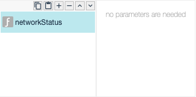

# networkStatus

## Description

Show network status

## Input / Parameters

## Output

## Callback

## Video

## Example

User want to know about network status

### Step

1. Call the function

    

    
### Result

### Video

- N/A
<!---->

## Links

- N/A