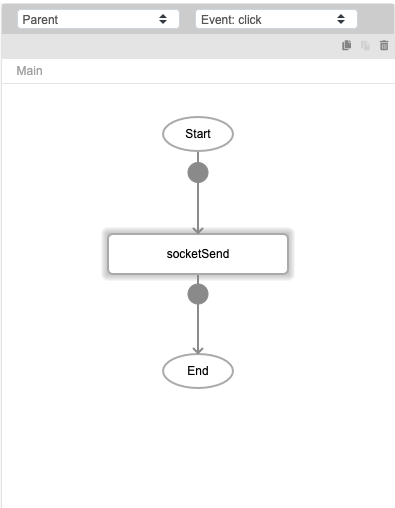

# socketSend

## Description

Sends data to a socket.

## Input / Parameter

| Name | Description | Input Type | Default | Options | Required |
| ------ | ------ | ------ | ------ | ------ | ------ |
| type | The type of connection. | String/Text | - | - | Yes |
| name | The name of the connection. | String/Text | default | - | No |
| event | The event to listen for. | String/Text | - | - | No |
| data | The data to send to the socket. | String/Text | - | - | No |

## Output

N/A

## Callback

### callback

The function to be executed if data is sent to the socket successfully.

### errorCallback

The function to be executed if data is not sent to the socket successfully.

## Video

Coming Soon.

<!-- Format:  -->

## Example

### Steps

1. First ensure that you have established a socket connection. See `socketConnect`.

    

2. Enter the details of data to be sent

    

### Result

You can specify a function to be called when successful, and another one to be called if it is unsuccessful. See `Callback`. 

## Links