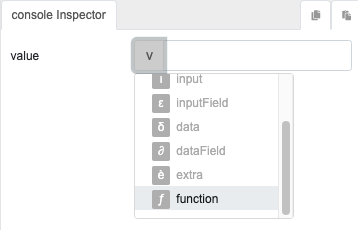
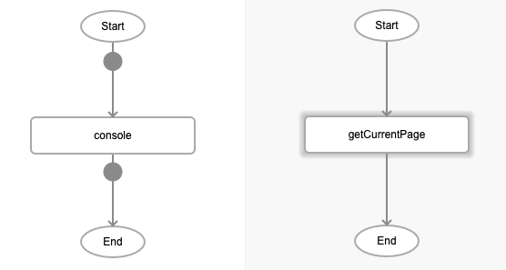

# getCurrentPage

## Description

Returns the name of the current page the user is on.

## Input / Parameter

N/A

## Output

| Description | Output Type |
| ------ | ------ |
| Returns the name of the current page. | String/Text |

## Callback

N/A

## Video

Coming Soon.

<!-- Format:  -->

## Example

The user wants to get the name of the current page they are on.

<!-- Share a scenario, like a user requirements. -->

### Steps

| No. | Description |  |
| ------ | ------ | ------ |
| 1. |  | Drag a button to a page in the mobile designer. Select the event `click` for the button and drag the `console` function to the event flow. |
| 2. |  | Select the `function` parameter input type for the value parameter. |
| 3. |  |Drag the `getCurrentPage` function to the node in the subflow. |

<!-- Show the steps and share some screenshots.

1. .....

Format:  -->

### Result

When the button is pressed, the console will show the name of the current page.

<!-- Explain the output.

Format:  -->

## Links