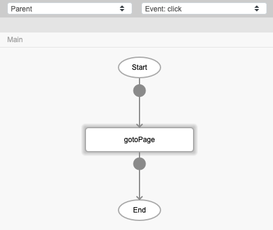

# gotoPage

## Description

Allows users to redirect from the current page they are on to another page.

## Input / Parameter

| Name | Description | Input Type | Default | Options | Required |
| ------ | ------ | ------ | ------ | ------ | ------ |
| p | The name of the page to navigate to. | String/Text | - | - | Yes |

## Output

N/A

Note: The page will be updated to show the page selected by the user.

## Callback

N/A

## Video

Coming Soon.

<!-- Format:  -->

## Example

The user wants to navigate to another page.

<!-- Share a scenario, like a user requirements. -->

### Steps

| No. | Description |  |
| ------ | ------ | ------ |
| 1. |  | Drag a button to a page in the mobile designer. Select the event `click` for the button and drag the `gotoPage` function to the event flow. |
| 2. |  | Fill in the parameters of the function. |

<!-- Show the steps and share some screenshots.

1. .....

Format:  -->

### Result

When the button is pressed, the page navigates to pgWelcome.

<!-- Explain the output.

Format:  -->

## Links