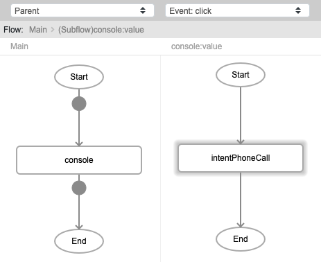
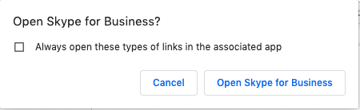
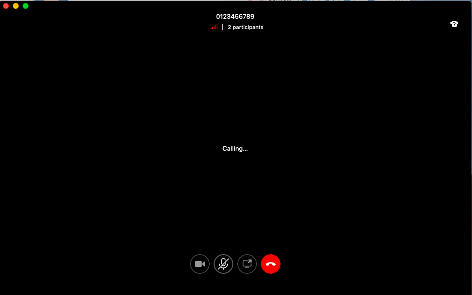

# intentPhoneCall

## Description

This function is used to start a call.

## Input / Parameter

| Name | Description | Input Type | Default | Options | Required |
| ------ | ------ | ------ | ------ | ------ | ------ |
| phone | The phone number to call. | String/Text | - | - | Yes |

## Output

N/A

## Callback

N/A

## Video

Coming Soon.

<!-- Format:  -->

## Example

The user wants to start a call.
 

### Step

1. Call the function `intentPhoneCall`.

    

    
    
2. Open the Skype app if using laptop/pc, press call if using phone.

    
    
### Result

## Links