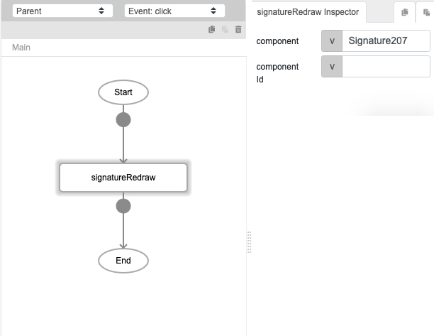

# signatureRedraw

## Description

Clears a canvas and allows users to redraw the signature.

## Input / Parameter

| Name | Description | Input Type | Default | Options | Required |
| ------ | ------ | ------ | ------ | ------ | ------ |
| component | The name of the component. | String/Text | - | - | Partial (Yes if no 'componentId'.) |
| componentId | The id of the component. | String/Text | - | - | Partial (Yes if no 'component'.) |

__\* Note:__ Either component or componentId must have value in order for this function to work.

## Output

N/A

## Callback

N/A

## Video

Coming Soon.

<!-- Format:  -->

## Example

### Steps

1. Add both a signature component and a button to the page. 

    

2. Select the button component and add `signatureRedraw` to the event flow. Enter the signature component's name `Signature207` in the "component" field. 

    

### Result

Clicking the button will clear the signature component. 

<!-- Explain the output.

Format:  -->

## Links