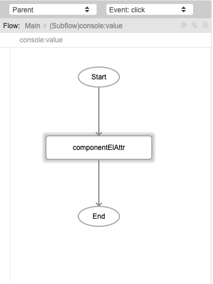
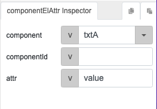

# componentElAttr

## Description

Returns the element attribute of a component, such as name, value etc.

## Input / Parameter

| Name | Description | Input Type | Default | Options | Required |
| ------ | ------ | ------ | ------ | ------ | ------ |
| component | The name of the component to get attribute from | String/Text | - | - | Partial (Yes if no 'componentId'.) |
| componentId | The id of the component to get attribute from | String/Text | - | - | Partial (Yes if no 'component'.) |
| attr | The attribute of the component. | String/Text | - | - | Yes |

__\* Note:__ Either component or componentId must have value in order for this function to work.

## Output

| Description | Output Type |
| ------ | ------ |
| Returns the element attribute of the component specified. | String/Text |

## Callback

N/A

## Video

Coming Soon.

<!-- Format:  -->

## Example

The user wants to get the value from a text box component.

### Step

1. Draw a edit text "txtA", a button "componentElAttr".

    

2. In button event, add a "console" then a "componentElAttr" function.

    

    

### Result

The value in edit text will be displayed in console.

## Links