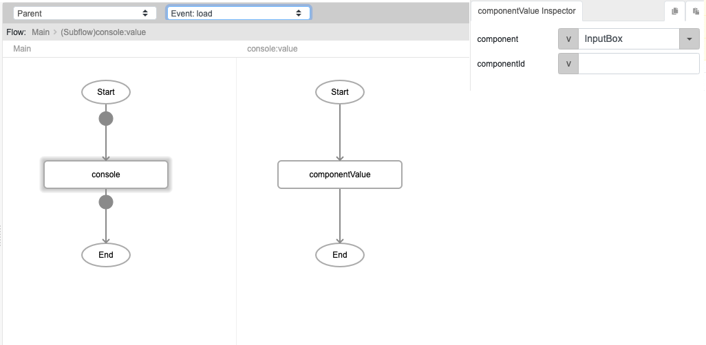
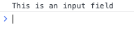

# componentValue

## Description

Returns the value of the component specified by the user. The component value can be displayed in another component using the [`setComponentValue`](./setComponentValue) function.

## Input / Parameter

| Name | Description | Input Type | Default | Options | Required |
| ------ | ------ | ------ | ------ | ------ | ------ |
| component | The name of the component that the value is retrieved from. | String/Text | - | - | Partial (Yes if no 'componentId'.) |
| componentId | The id of the component that the value is retrieved from. | String/Text | - | - | Partial (Yes if no 'component'.) |

__\* Note:__ Either component or componentId must have value in order for this function to work.

## Output

| Description | Output Type |
| ------ | ------ |
| Returns the value of the component specified. | String/Text |

## Callback

N/A

## Video

## Example

In this example we will get the component value of an input field using `componentValue` and print it to the console. 

### Steps

1. First we drag an input box onto the page. We will name it "InputBox" with the value "This is an input field"

2. We want to get the value of "InputBox" and display it in the browser console with the help of the `console` helper function. 
   
3. Drag `componentValue` into the event flow, and specify the name of the component, which in this case is "InputBox".

### Result

- The value of "InputBox" will be displayed in the browser console.

## Links

See also: 

* [`setComponentValue`](./setComponentValue)