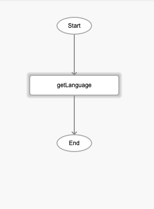

# getLanguage

## Description

Returns the language of the app. The default language is set to English.

## Input / Parameter

N/A

## Output

| Description | Output Type |
| ------ | ------ |
| Returns the language of the app. | String/Text |

## Callback

N/A

## Video

Coming Soon.

<!-- Format:  -->

## Example

The user wants get the language of the app.

### Step

1. Call the function.

    

### Result

Language of the app eg English. 

### Notes
- user can use functions: setLangugage -> getLanguage to change the language of app provided the language mapping is done.

## Links