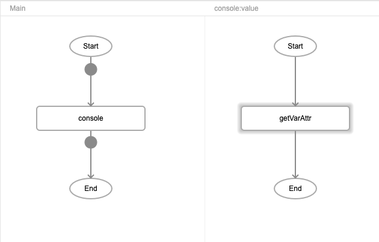
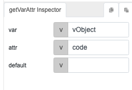

# getVarAttr

## Description

Returns the attribute value of an object or array variable.

## Input / Parameter

| Name | Description | Input Type | Default | Options | Required |
| ------ | ------ | ------ | ------ | ------ | ------ |
| var | The name of the variable. | String/Text | - | - | Yes |
| attr | The attribute of the variable to be obtained. | String/Text | - | - | Yes |
| default | The default value of the variable. | String/Text | - | - | Yes |

## Output

| Description | Output Type |
| ------ | ------ |
| Returns the attribute value of the object if there is a value, returns default value passed by the user otherwise. | String/Text |

## Callback

N/A

## Video

Coming Soon.

<!-- Format:  -->

## Example

The user wants to use a value of an attribute from global variable which had been declared.

### Step

1. Assuming you have followed the "setVar" fuction in help document, call the function.

    
    

### Result

In console, user can the string "CodeABC". If user variable "vObject" have no value, it will display "No Value".

<!-- Explain the output.

Format:  -->

## Links