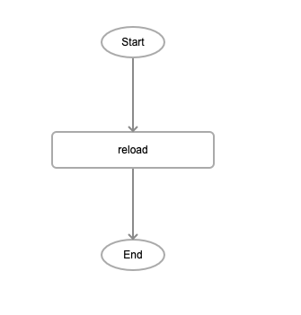

# reload

## Description

Refreshes the current page to show any changes.

## Input / Parameter

N/A

## Output

N/A

## Callback

N/A

## Video

Coming Soon.

<!-- Format:  -->

## Example

The user wants to reload the current page.

### Step

1. Call the function.

    

### Result

The page will be reloaded.

## Links