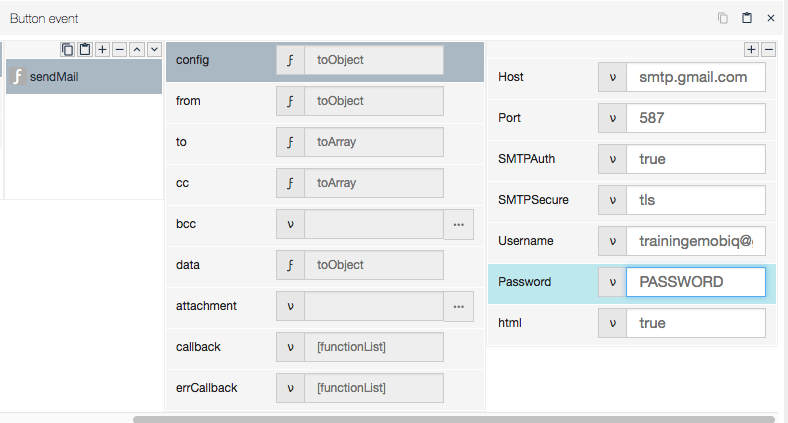
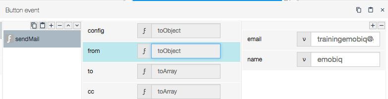
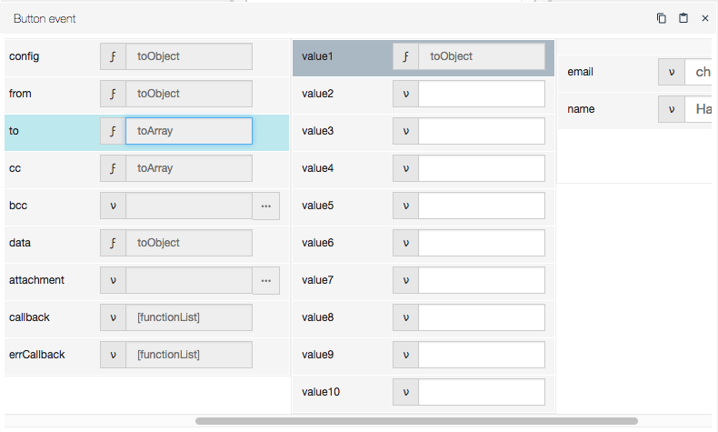
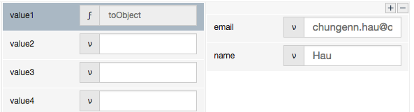
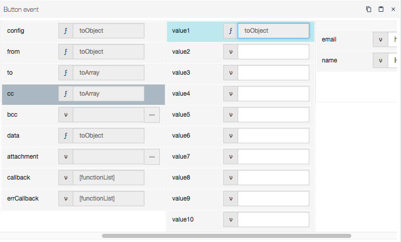
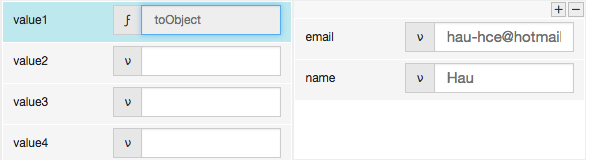
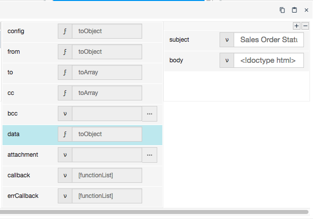
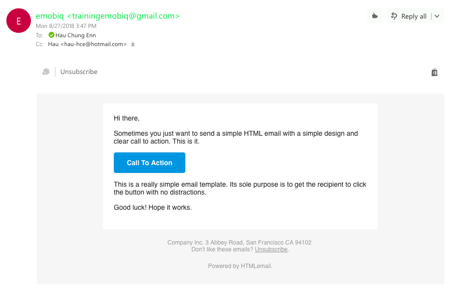

#  sendMail

## Description

Sends an email through the app.

## Input / Parameter

| Name | Description | Input Type | Default | Options | Required |
| ------ | ------ | ------ | ------ | ------ | ------ |
| config | The configuration of the email to be sent. | Object | - | - | Yes |
| from | The name of the sender. | Object | - | - | Yes |
| to | The name of the recipient. | Array/List | - | - | Yes |
| cc | The carbon copy. | Array/List | - | - | No |
| bcc | The blind carbon copy. | Array/List | - | - | No |
| data | The contents of the email. | Object | - | - | Yes |
| attachment | The file(s) to be attached. | Array/List | - | - | No |

## Output

N/A

## Callback?

### callback

The function to be executed when the email is sent successfully.

### errCallback

The function to be executed when the email is not sent successfully.

## Video

Coming Soon.

<!-- Format:  -->

## Example

The user want to send an email via the app.

### Step

1. Call the sendMail function, add toObject function in "config" parameter as below:

    

2. For "from" paremeter, add toObject with "email" & "name".

    

3. For "to" paremeter, add toArray function then toObject funtion.

    

    Add fields "email" & "name".

    

4. For "cc" paremeter, add toArray function then toObject funtion.
   
    

    Add fields "email" & "name".

    

5. For "data" paremeter, add toObject function then add fields "subject" "body". 

    
    
### Result

Email Received:

## Links
