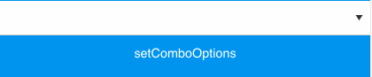
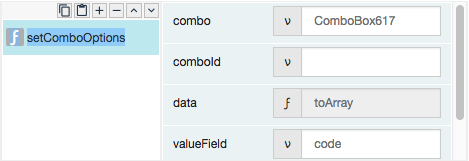
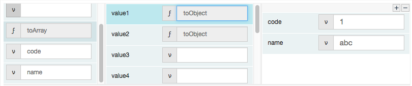
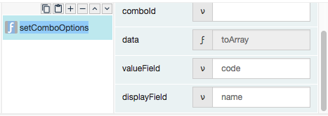
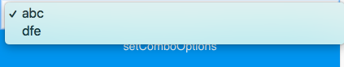

# setComboOptions

## Description

Allows users to set the values or options for a combo box component.

## Input / Parameter

| Name | Description | Input Type | Default | Options | Required |
| ------ | ------ | ------ | ------ | ------ | ------ |
| combo | The name of the combo box component. | String/Text | - | - | Partial (Yes if no 'comboId'.) |
| comboId | The id of the combo box component. | String/Text | - | - | Partial (Yes if no 'combo'.) | 
| data | The list of options. | Array/List | - | - | Yes |
| valueField | The attribute name of the value inputs. | String/Text | - | - | Yes |
| valueSeparator | The separator used to separate the value. | String/Text | - | - | No |
| displayField | The attribute name of the dropdown values. | String/Text | - | - | Yes |
| displaySeparator | The separator used to separate the display. | String/Text | - | - | No |

__\* Note:__ Either combo or comboId must have value in order for this function to work.

## Output

N/A

Note: The component will be updated to show the combo box options.

## Callback

N/A

## Video

Coming Soon.

<!-- Format:  -->

## Example

The user want to make a not visible component to visible.

### Step

1. Draw a combo box "ComboBox617", a button "setComboOptions".

    
    

2. Call the function

    
    

3. Populate an array into data parameter by adding "toArray" & "toObject" functions.

    
    

4. Define the value field & display field.

    
    
### Result

The combo box "ComboBox617" have the display values of "abc" & "dfe" & the value of "abc is 1, value of "dfe" is 2.

## Links