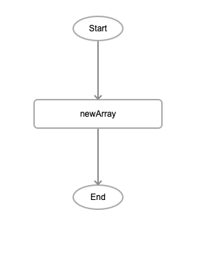
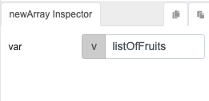
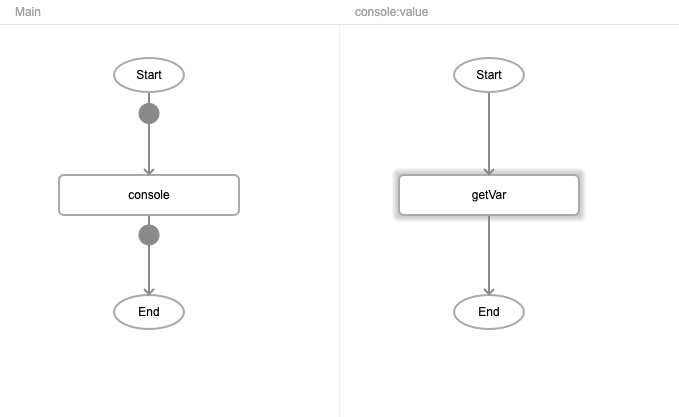
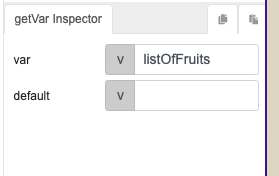
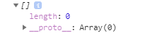

# newArray

## Description

Creates an empty array.

## Input / Parameter

| Name | Description | Input Type | Default | Options | Required |
| ------ | ------ | ------ | ------ | ------ | ------ |
| var | The name of the new array. | String/Text | - | - | Yes |

## Output

| Description | Output Type |
| ------ | ------ |
| Returns the new empty array. | Array/List |

## Callback

N/A

## Video

Coming Soon.

<!-- Format:  -->

## Example

The user wants to create a new array.

### Step

1. Call the function"newArray" and set the         variable name. 
   var: listOfFruits 
    
    
    
    
    
2. Add a console and call the function "getVar"

    
    
    
  
    
### Result

User create a new array successfully. 

## Links