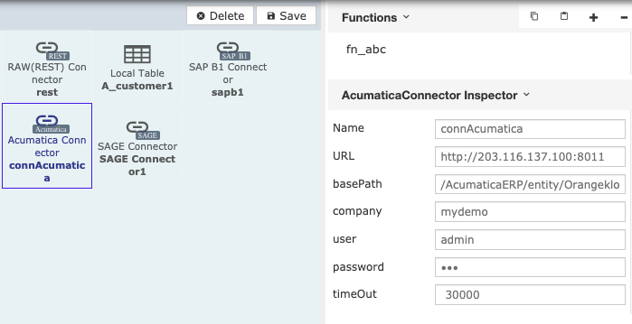
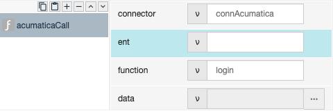

# acumaticaCall 

## Description

AcumaticaCall is the function to generate the token session.

## Input / Parameter

| Name | Description | Input Type | Default | Options | Required |
| ------ | ------ | ------ | ------ | ------ | ------ |
| connector | Name of connector and created in the Services and Global Components page. | String/Text | - | - | Yes |
| ent | The Web Service name to be called. | String/Text | - | - | No |
| function | The function name to be called. | String/Text | - | - | Yes |
| data |   | Object | - | - | No |
| files |   | String | - | - | No  |
| extra |   | String | - | - | No  |

## Output

## Callback

## Video

## Example

User want to generate token session for ASP.Net

### Step

1. Create Acumatica Connector in Services and define the name, url, basepath, company, user, password and timeOut.
    Name: connAcumatica 
   url: http://203.116.137.100:8011 ( Please refer to the picture below, there is a example of main web service.We have take one of the operation as an example to apply for this function.) 
   basepath: /AcumaticaERP/entity/Orangekloud/18.200.001 
   company: mydemo 
   user: admin 
   password: *** 
   timeOut: 30000
   
   
   
2. Call the function "acumaticaCall".
    
   
   
   
   
   
 
### Result

emobiqApp.js?53:4456 ASP.NET_SessionId=afnllmm0512f1o01gxeuqrbp;UserBranch=16;LegacyUI=0;Locale=Culture=en-US&TimeZone=GMTM0800A;CompanyID=mydemo;.ASPXAUTH=49FCD47815A0C8AB42A759F7075F8CBC1300C95DE035B43E221BD674DE6FDD50E025F9145B9F2D30B4799B2596408DD6AE10EB0D215CD0F8197C8410928F23ACD93A6C001F14865E0766484A5A4F6CC880C2AA03DEBFE9C823D639D65E8C304E6D5ACD96FAF6F2C34F5D5A4C6F25C1219B2E341128C98CD6327C2DF9B2351BEBC85E96E2

## Links