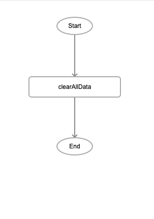
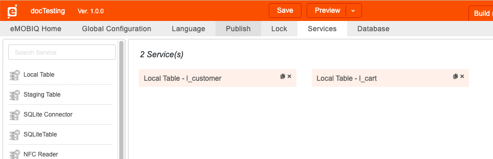
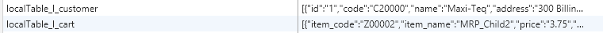
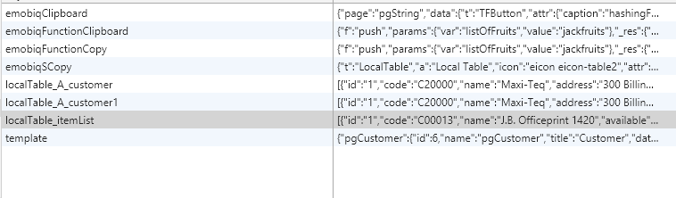

# clearAllData

## Description

Removes all the local tables in a project, excluding the datasets specified.

## Input / Parameter

| Name | Description | Input Type | Default | Options | Required |
| ------ | ------ | ------ | ------ | ------ | ------ |
| except | The datasets that should not be removed. | String/Text | - | - | No |

## Output

N/A

## Callback

N/A

## Video

Coming Soon.

<!-- Format:  -->

## Example

The user wants to delete all the dataset in a project.

### Step

1. Call the function.
   
   
   
### Result

Before calling the function `clearAllData`, the
L_customer and l_cart both exist as local tables.

After calling the `clearAllData`, both tables have been removed.

## Links