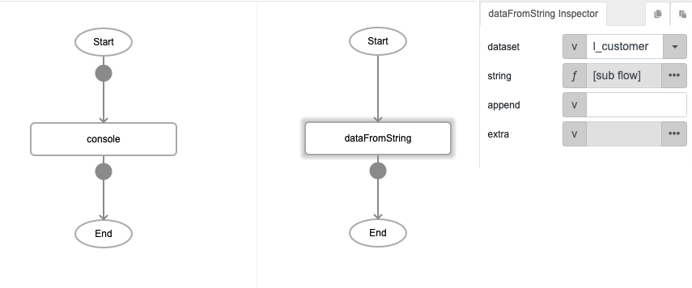
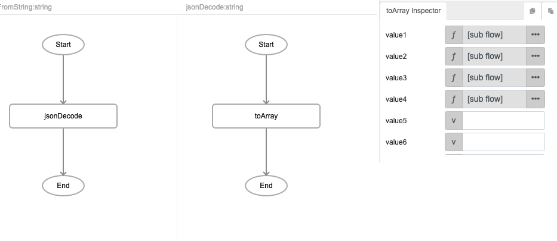
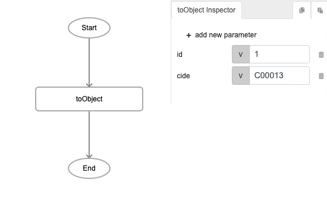
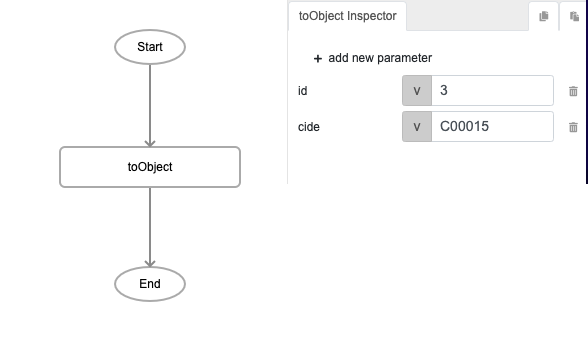
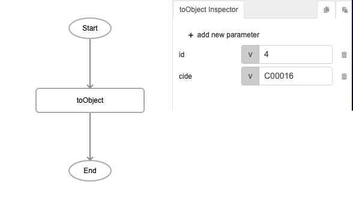
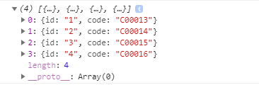
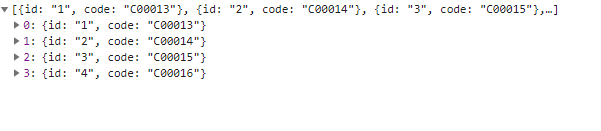

# dataFromString

## Description

This will replace all the existing records in the local table with the new records. The values inserted must be in a JSON format.

## Input / Parameter

| Name | Description | Input Type | Default | Options | Required |
| ------ | ------ | ------ | ------ | ------ | ------ |
| dataset | The name of the local table to be edited. | String/Text | - | - | Yes |
| string | The values to be inserted in the local table. | Array/List | - | - | Yes |
| append | Inserts the specified content at the end of a selected element. | String/Text | - | - | No |
| extra | Extra parameters stored and passed to callback. | Any | - | - | No |

## Output

| Description | Output Type |
| ------ | ------ |
| Returns the list of records in the local table. | Array/List |

## Callback?

### callback

The function to be executed if the local table is updated with the new records successfully.

### errorCallback

The function to be executed if the local table is not updated with the new records successfully.

## Video

Coming Soon.

<!-- Format:  -->

## Example

The user wants to replace all the existing records in the local table with the new ones. 

### Step

1. Call the function "dataFromString", set the dataset and set the          function "jsonDecode" to string. 
   dataset: l_customer 
   string: jsonDecode 
    
    
    
2. Call the function "toArray" and set the function "toObject" to string    and define the id and code. 
   string: toObject 
   id: 1 
   code: C00013 
   id: 2 
   code: C00014 
   id: 3 
   code: C00015 
   id: 4 
   code: C00016 
   
   
   
   
   
   
   
   
   
   
  
    
### Result

 

## Links