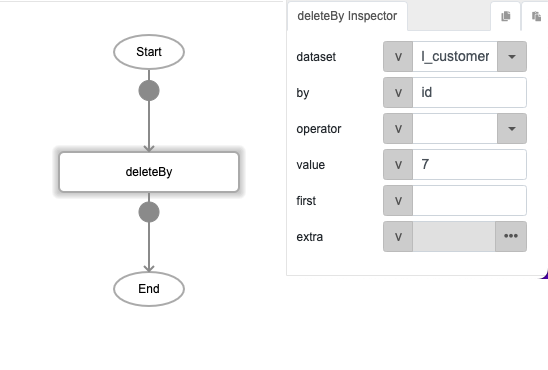
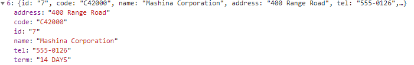
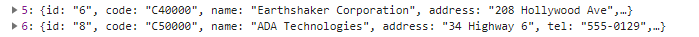

# deleteBy

## Description

Removes specified records from a dataset.

## Input / Parameter

| Name | Description | Input Type | Default | Options | Required |
| ------ | ------ | ------ | ------ | ------ | ------ |
| dataset | The name of the local table to remove the record from. | String/Text | - | - | Yes |
| by | The name of the field to remove the record from. | String/Text | - | - | Yes |
| operator | The operator to use to determine the records to remove. | String/Text | = | =, >, <, >=, <=, !=, like, ilike | No |
| value | The records to be removed from the local table. | String/Text | - | - | Yes |
| first? | ? | String/Text | - | - | No |
| extra | Extra parameters stored and passed to callback. | Any | - | - | No |

## Output

| Description | Output Type |
| ------ | ------ |
| Returns the updated local table as a list. | Array/List |

## Callback?

### callback

The function to be executed if the specified records are removed successfully.

### errorCallback

The function to be executed if the specified records are not removed successfully.

## Video

Coming Soon.

<!-- Format:  -->

## Example

The user wants to delete the id=7 from dataset "l_customer".

### Step

1. Call the function "deleteBy" and define the dataset,  by, and             value.
    
   dataset: l_customer 
   by: id 
   value: 7 
  
   
   
### Result

( Before delete, id=7 is still display in the dataset "l_customer" )

( After delete, id=7 was being removed )
   

## Links