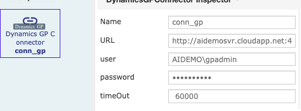
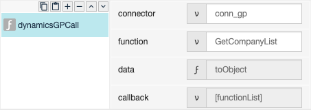
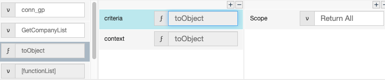
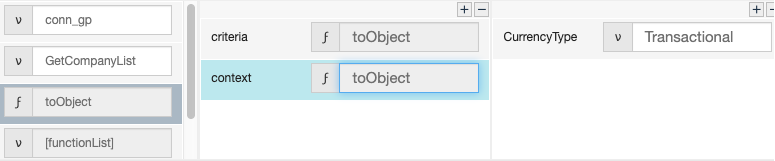
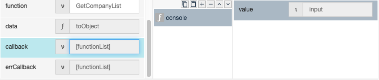
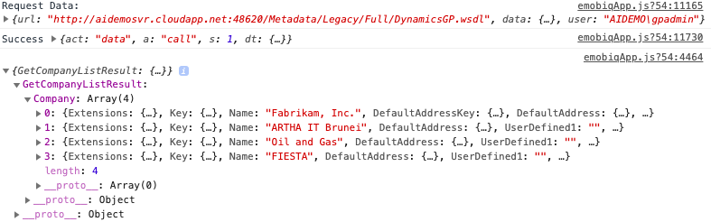

# dynamicsGPCall

## Description

Is a function that needed if user want to use a function from web services.

## Input / Parameters

| No | Name | Description | Data Type | Required |
| ------ | ------ | ------ |------ | ------ |
| 1 | connector | Name of connector and created in the Services and Global Components page. | String | Yes  |
| 2 | function | The function from the Web Service to be executed. | String | Yes  |
| 3 | data | This contains the main parameter in the function being called. | Object | Yes |

## Output

## Callback

## Video

## Example

User wants to call the dynamicsGP Web Service.

### Step

1. Create dynamics GP Connector in Services and         define the name, url and timeOut.
    Name: conn_gp 
   url: http://aidemosvr.cloudapp.net:48620/Metadata/Legacy/Full/DynamicsGP.wsdl  
    user:AIDEMO\gpadmin
    password: *******
    timeOut: 60000
   
   
   
2. Call the function "dynamicsGPCall".
   
   
   
3. Define toObject.
    

   
  
  
  
4. Add a console after callback function for       display response from console.   
   
   
 
### Result
   

## Links