# Query  

## Description

A query is a request for data or information from a database table or combination of tables.

## Input / Parameters

| No | Name | Description | Data Type | Required | Example |
| ------ | ------ | ------ |------ | ------ | ------ |
| 1 | dataset | Name of the dataset to be read in local table. | String | Yes |
| 2 | query | A request for data or information from a database table.  | String | Yes |  </a> https://www.javatpoint.com/mysql-queries</a>

## Output

## Callback

## Video

## Example

The user wants to update the data for table tbl_sqllite_customer by using the query.

### Step

1. Create the SQLiteTable in Services and fill     the info such as Name and fields. Call the function "insert" for insert data into table before you update.Define the dataset, set the toObject to dt and define code and name.
    
   Name: tbl_sqllite_customer 
   fields: code and name 
   Dataset: tbl_sqllite_customer 
   dt: toObject 
   code: B 
   name: abc 
   name: aaa 
   code: 1111 
   
   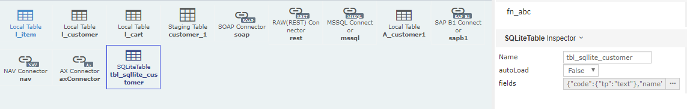
   
   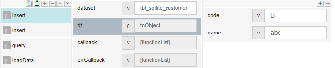
   
   
   
2. Call the function "query" for update the data    and define the dataset and query.
    
   dataset: tbl_sqllite_customer 
   query: UPDATE tbl_sqllite_customer SET code = 'A1' WHERE code='B' 
   
   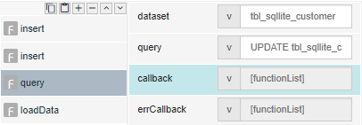
   
3. Call the function "loadData" and define the     dataset.
    
   dataset: tbl_sqllite_customer 
   
   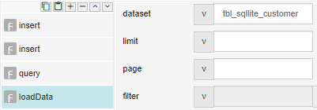
   
 
### Result

## Links

### Notes

insert

1. Call the function "insert" and define the       dataset and set the function "toObject" to       data & define the code and name. ( We        assumed you have created the SQLiteTable in     Services and fill the info such as Name and     fields. )
    
   Dataset: tbl_sqllite_customer 
   dt: toObject 
   code: B 
   name: abc 
   name: aaa 
   code: 1111 
   
   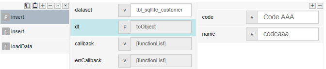
   
   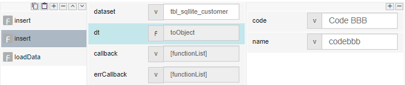
   
2. Call the function "loadData" and define the     dataset.
    
   dataset: tbl_sqllite_customer 
   
   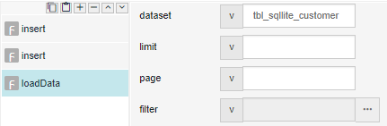
   
updateby

1. Call the function "updateBy" and define the     dataset, by, operator and value. 
   ( We assumed you    have created the SQLiteTable in Services and    fill the info such as Name and fields. )
    
   Dataset: tbl_sqllite_customer 
   by: code 
   operator: = 
   value: Code AAA 
   
   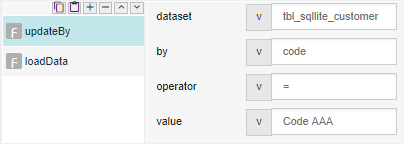
   
   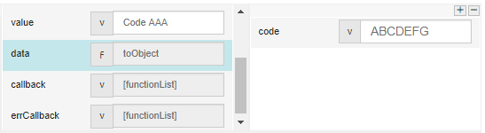
   
2. Call the function "loadData" and define the     dataset.
    
   dataset: tbl_sqllite_customer 
  
   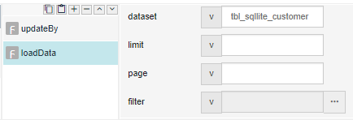
   
deleteBy

1. Call the function "deleteBy" and define the     dataset, by, and value. 
   ( We assumed you    have created the SQLiteTable in Services and    fill the info such as Name and fields. )
    
   Dataset: tbl_sqllite_customer 
   by: code 
   value: Code BBB 

   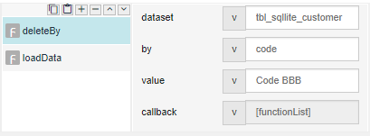
   
2. Call the function "loadData" and define the     dataset.
    
   dataset: tbl_sqllite_customer 
 
   

