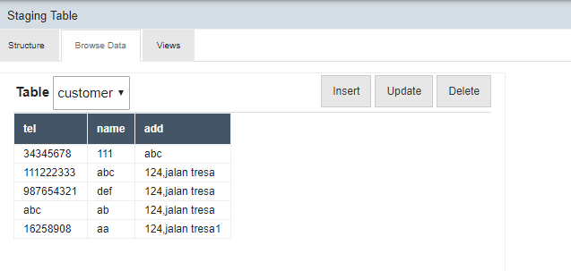
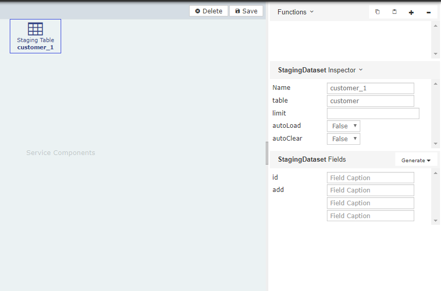
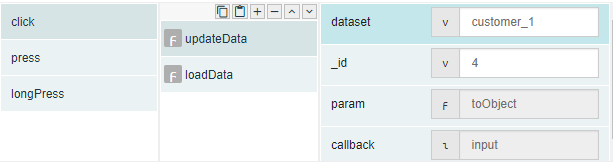
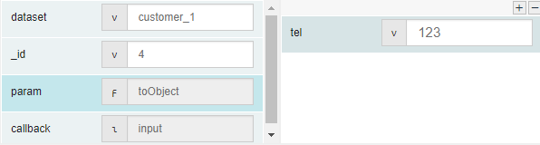
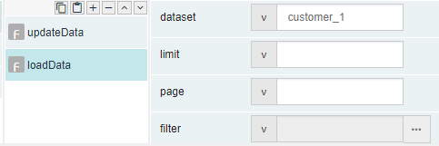
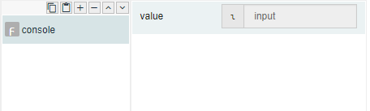
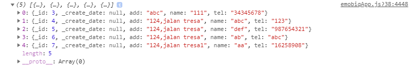
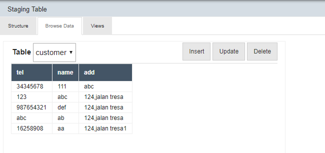

# updateData 

## Description

Update a record from a staging database.

## Input / Parameters

| No | Name | Description | Data Type | Required |
| ------ | ------ | ------ |------ | ------ |
| 1 | dataset | Name of the dataset in staging table where record will be updated. | String | Yes  |
| 2 | _id | Value from the staging database and used for identify which record will be updated. | Integer | Yes  |
| 3 | param | The data to be updated from the staging database. | Object | Yes |

## Output

## Callback

## Video

## Example

The user wants to update the data from staging table.

### Step

1. Create a table with a table name and field in         staging table and      create a dataset in         Services. (We assumed that the table ,             field and dataset have been created.)
    
   table name: customer 
   Fields name: tel, name and add 
   Dataset: customer_1 
   Set value: tel:111222333, name: abc, add:124,jalan tresa

  
        
  

2. Call the function "updateData", define the         dataset & id and set    function "toObject"to      param.
    
   dataset: customer_1 
   _id: 4 
   param: toObject
   
  
   
3. Define the tel.
    
   tel: 123 
   
  
   
4. Call the function "loadData" and set the dataset.
    
   dataset: customer_1 
 
  
   
5.  Add a console after callback for display the response from console.

  
  
### Result

( The row 2, tel no have been successful to be update into no 123.)

## Notes

- N/A