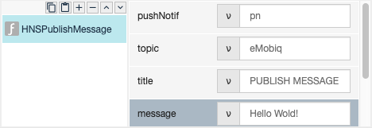

# HNSPublishMessage

## Description

To send notifaction to other users and include some messages.

## Input / Parameters

- N/A

## Output

## Callback

## Video

## Example

The user want to notify other users.

### Step

1. Call the function.  
    
    
    
### Result

- N/A

### Video

- N/A
<!---->

## Links

- N/A