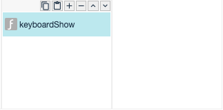

# keyboardHide

## Description

Show keyboard of mobile device.

## Input / Parameters

- N/A

## Output

## Callback

## Video

## Example

The user want to show the keyboard when the edit text is focused.

### Step

1. Call the keyboardShow function. 

    
    
### Result

Keyboard is shown.

<!--

Keyboard of mobile device will be dismissed. 

-->

### Video

- N/A
<!---->

## Links

- N/A