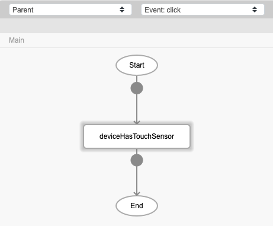
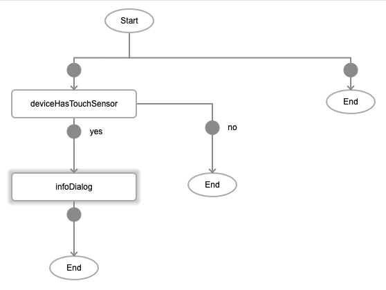
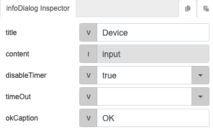

# deviceHasTouchSensor

## Description

Activates the touch sensor (fingerprint) feature of a mobile device.

## Input / Parameter

N/A

## Output

N/A

## Callback

### callback

The function to be executed if the touch sensor is activated successfuly.

### errorCallback

The function to be executed if the touch sensor is not activated successfully.

## Video

Coming Soon.

<!-- Format:  -->

## Example

The user wants to activate the touch sensor feature of their mobile device.

<!-- Share a scenario, like a user requirements. -->

### Steps

| No. | Description |  |
| ------ | ------ | ------ |
| 1. |  | Drag a button to a page in the mobile designer. Select the event `click` for the button and drag the function `deviceHasTouchSensor` to the event flow. |
| 2. |  | Drag the function to be executed when the touch sensor is activated successfully. In this example, we are using the `infoDialog` function. |
| 3. |  | Fill in the parameters of the function. |

<!-- Show the steps and share some screenshots.

1. .....

Format:  -->

### Result

When the button is pressed, the infoDialog will appear to confirm that the touch sensor has been activated.

<!-- Explain the output.

Format:  -->

## Links