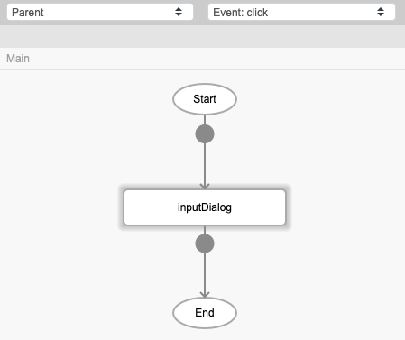
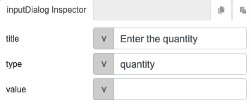
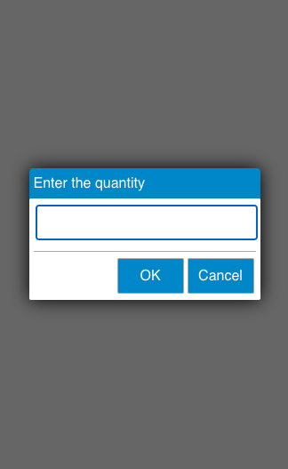

# inputDialog

## Description

Displays a dialog box (modal) that requires the user to enter some input.

## Input / Parameter

| Name | Description | Input Type | Default | Options | Required |
| ------ | ------ | ------ | ------ | ------ | ------ |
| title | The title of the dialog box. | String/Text | - | - | Yes |
| type | The type of input to enter in the dialog box. | String/Text | - | - | Yes |
| value | Default value to be displayed in the input field of the dialog box. | Integer | - | - | No |
   
## Output

N/A

Note: A modal will pop up which displays the parameters specified by the user.

## Callback

### okCallback

The function to be executed when user clicks on the 'OK' button.

### cancelCallback

The function to be executed when user clicks on the 'Cancel' button.

## Video

Coming Soon.

<!-- Format:  -->

## Example

The user wants to display an input dialog that allows the end user to key in a quantity.

<!-- Share a scenario, like a user requirements. -->

### Steps

| No. | Description |  |
| ------ | ------ | ------ |
| 1. |  | Drag a button to a page in the mobile designer. Select the event `click` for the button and drag the `inputDialog` function to the event flow. |
| 2. |  | Fill in the parameters of the function. |

<!-- Show the steps and share some screenshots.

1. .....

Format:  -->

### Result

| No. | Description |
| ------ | ------ |
|  | When the button is pressed, the inputDialog modal appears in which users can enter their input. |

<!-- Explain the output.

Format:  -->

## Links