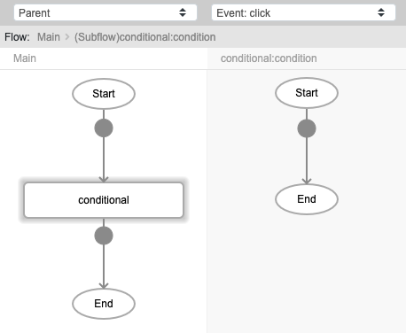
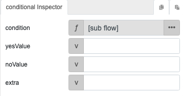
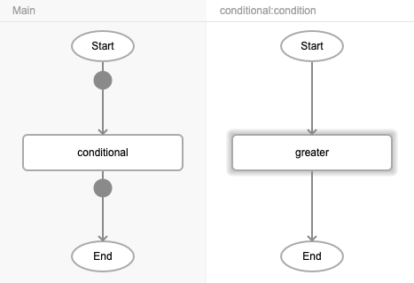
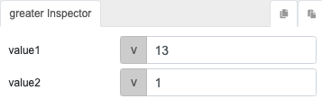
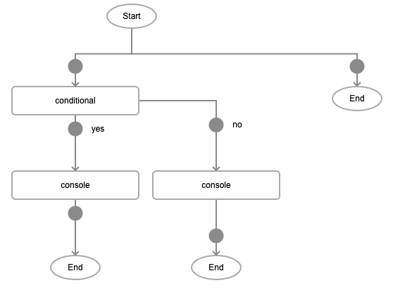
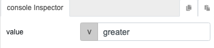
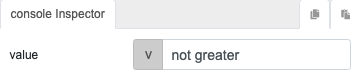

# conditional

## Description

Checks whether the condition passed is met and executes the callback functions accordingly.

## Input / Parameter

| Name | Description | Input Type | Default | Options | Required |
| ------ | ------ | ------ | ------ | ------ | ------ |
| condition | The condition to be checked against. | String/Text | - | - | Yes |
| yesValue | The output value if condition is 'true'. | Any | - | - | No |
| noValue | The output value if condition is 'false. | Any | - | - | No |
| extra | Extra parameters stored and passed to callback. | Any | - | - | No |

## Output

| Description | Output Type |
| ------ | ------ |
| Returns the 'yesValue' or 'noValue'. | Any |

## Callback

### yesCallback

The function to be executed when the condition passed is 'true'.

### noCallback

The function to be executed when the condition passed is 'false'.

## Video

Coming Soon.

<!-- Format:  -->

## Example

The user wants to prove that the value `13` is greater than the value `1` and see the result in the console.

### Step

| No. | Description |  |
| ------ | ------ | ------ |
| 1. |   | Drag a button to a page in the mobile designer. Select the event `click` for the button and drag the `conditional` function to the event flow. Select the `function` parameter input type for the `condition` parameter. |
| 2. |  | Drag the function `greater` to the subflow. |
| 3. |  | Fill in the inputs of the `greater` function. |
| 4. |  | Drag the function `console` to the `yesCallback` and `noCallback` nodes of the `conditional` function. |
| 5. |   | The `console` function in `yesCallback` should return 'greater' while the `console` function in `noCallback` should return 'not greater'. |

### Result

When the button is pressed, the console will print 'greater'.

## Links