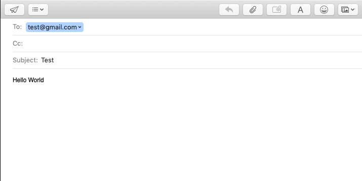

# intentSendEmail

## Description

This function will start an email on the user's device's default email application. 

## Input / Parameters

| Name | Description | Input Type | Default | Options | Required |
| ------ | ------ | ------ | ------ | ------ | ------ |
| email | Recipient's email address | String | - | - | Yes | 
| subject | Title of email | String | - | - | Yes |
| body | Body of email | String | - | - | No |  

## Output

Opens the default email application on user's device with the fields populated by input.

## Callback

## Video 

## Example

The user wants to start an email
 

### Steps

Using `intentSendEmail` with the parameters

|  | value |
| ---- | ---- | 
| email | test@gmail.com|
| subject | Test | 
| body | Hello World | 

### Result

If user is on a MacOS device, they will see this: 

## Links

Coming Soon.