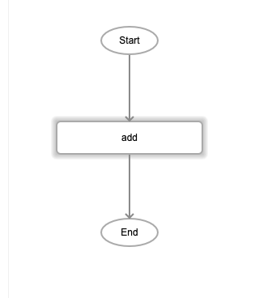
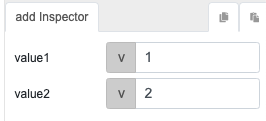

# add

## Description

Addition of two numbers. The output will return the sum of the two numbers.

## Input / Parameter

| Name | Description | Input Type | Default | Options | Required |
| ------ | ------ | ------ | ------ | ------ | ------ |
| value1 | The first number to add. | Number | - | - | Yes |
| value2 | The second number to add. | Number | - | - | Yes |

## Output

| Description | Output Type |
| ------ | ------ |
| Returns the sum of the two values. | Number |

## Callback

N/A

## Video


<!-- Format: []({url-link}) -->

## Example

1. Drag the `add` function into the event flow.

    

2. Enter the 2 values to be added together. For this example they are `1` and `2`.

    


### Results

```3```

## Links