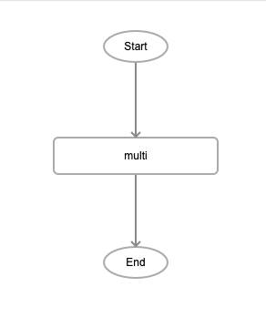
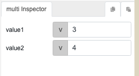

# multi

## Description

Multiplication of two numbers. The output will return the product of the two numbers.

## Input / Parameter

| Name | Description | Input Type | Default | Options | Required |
| ------ | ------ | ------ | ------ | ------ | ------ |
| value1 | The first number to multiply. | Number | - | - | Yes |
| value2 | The second number to multiply. | Number | - | - | Yes |

## Output

| Description | Output Type |
| ------ | ------ |
| Returns the product of the two values. | Number |

## Callback

N/A

## Video

Coming Soon.

<!-- Format: []({url-link}) -->

## Example
 

1. Drag the `multi` function into the event flow.

    

2. Enter the 2 values to be multiplied together. For this example they are `3` and `4`.

    
### Result

```
12
```
<!-- Explain the output.

Format:  -->

## Links