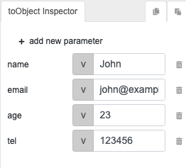

# objectValues

## Description

Creates an array/list of the attribute/property values of an object.

## Input / Parameter
    
| Name | Description | Input Type | Default | Options | Required |
| ------ | ------ | ------ | ------ | ------ | ------ |
| object | The object to get the attribute/property values. | Object | - | - | Yes |

## Output   

| Description | Output Type |
| ------ | ------ |
| Returns the array/list of the attribute/property values. | Array/List |

## Callback

N/A

## Video


## Example



Given the above object, `objectValues` function will return this list:

```JS
["John", "john@example.com", "23", "123456"]
```

## Links

* See also `objectKeys` and `objectAttr`