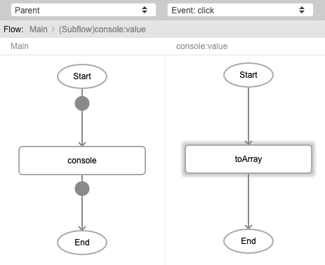
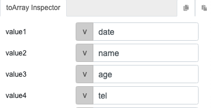
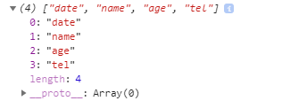

# toArray

## Description

Creates an array/list of the passed data.

## Input / Parameter
    
| Name | Description | Input Type | Default | Options | Required |
| ------ | ------ | ------ | ------ | ------ | ------ |
| value1 | The first value to add in the array/list. | Any | - | - | No |
| value2 | The second value to add in the array/list. | Any | - | - | No |
| value3 | The third value to add in the array/list. | Any | - | - | No |
| value4 | The fourth value to add in the array/list. | Any | - | - | No |
| value5 | The fifth value to add in the array/list. | Any | - | - | No |
| value6 | The sixth value to add in the array/list. | Any | - | - | No |
| value7 | The seventh value to add in the array/list. | Any | - | - | No |
| value8 | The eight value to add in the array/list. | Any | - | - | No |
| value9 | The ninth value to add in the array/list. | Any | - | - | No |
| value10 | The tenth value to add in the array/list. | Any | - | - | No |

## Output   

| Description | Output Type |
| ------ | ------ |
| Returns the created array with the passed data. | Array/List |

## Callback

N/A

## Video

Coming soon.

## Example

The user wants to create a list of data and view it in the console.

### Step

1. Call the `console` function. Call the `toArray` function inside the `value` parameter of the `console` function.
     
    value1 : date 
    value2 : name 
    value3 : age 
    value4 : tel 
    
    

    

### Result

## Links