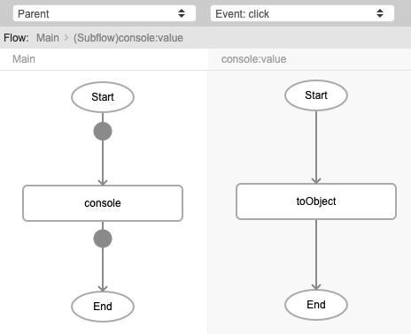
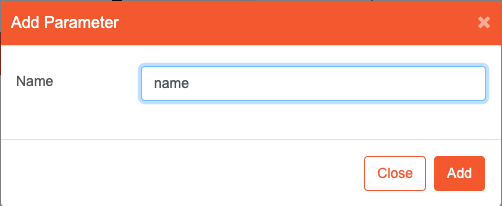
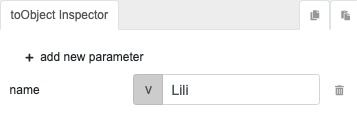
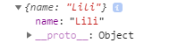

# toObject

## Description

Creates an object of the passed data.

## Input / Parameter

| Name | Description | Input Type | Default | Options | Required |
| ------ | ------ | ------ | ------ | ------ | ------ |
| {Dynamic} | {Based on user inputs.} | Any | - | - | No |

Note: Dynamic input means that user can generate the necessary input required and assign a value in it as well. 

## Output   

| Description | Output Type |
| ------ | ------ |
| Returns the created object with the passed data. | Object |

## Callback

N/A

## Video

Coming soon.

## Example

The user wants to create an object data and view it in the console.

### Step

1. Call the function `console`. Call the function `toObject` inside the `value` parameter of the `console` function.
  
    
  
2. Add a key. 
   Key : name  
  
    
 
3. Assign a value to the key. 
    name : Lili
    
    

### Result

## Links