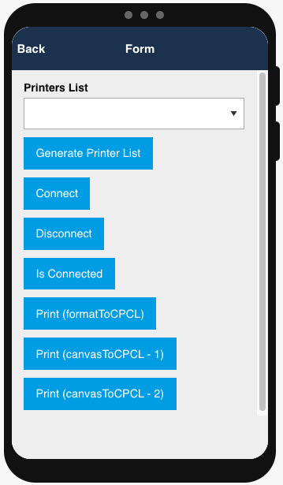
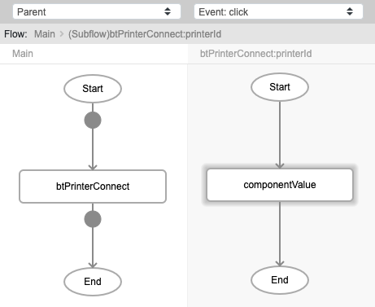
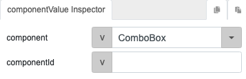
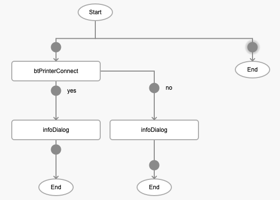
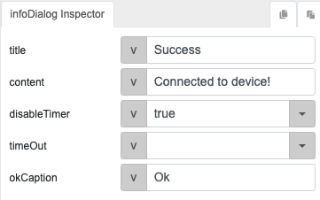
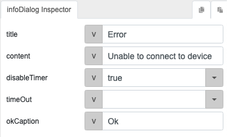
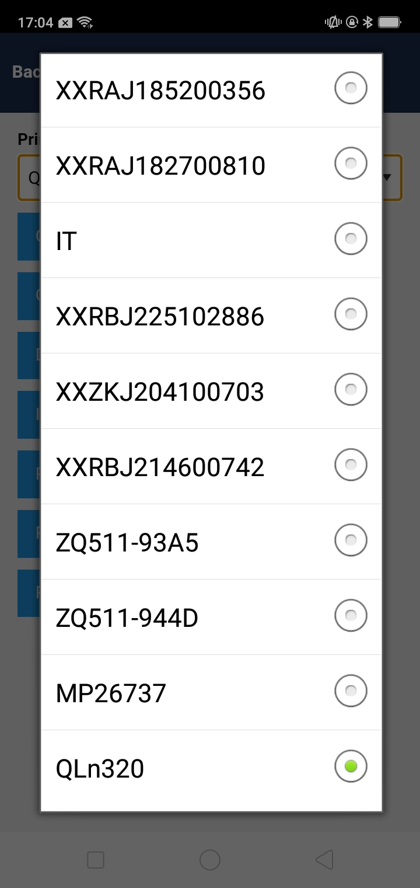
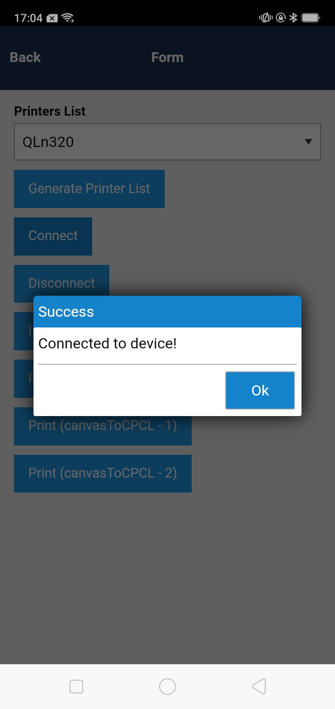

# btPrinterConnect

## Description

Connects a bluetooth printer to the device.

## Input / Parameter

| Name | Description | Input Type | Default | Options | Required |
| ------ | ------ | ------ | ------ | ------ | ------ |
| printerID | The id of the printer to connent. | String/Text | - | - | Yes |
| extra | Extra parameters stored and passed to callback. | Any | - | - | No |

## Output

N/A

## Callback

### callback

The function to be executed if the printer is connected successfully.

### errCallback

The function to be executed if the printer is not connected successfully.

## Video

Coming Soon.

<!-- Format:  -->

## Example

The user wants to connect a printer to their device.

<!-- Share a scenario, like a user requirements. -->

### Steps

1. Drag a combobox and button component to a page in the mobile designer. Call the function `btPrinterConnect` in the button component. 

    

2. Call the function `componentValue` in the `printerId` parameter of the `btPrinterConnect` function. Select the combobox component in the `component` parameter of the `componentValue` function to view the printers connected.

    

    

3. Call the function `infoDialog` in the callbacks of the `btPrinterConnect` function.

    

    

    

<!-- Show the steps and share some screenshots.

1. .....

Format:  -->

### Result

1. Select the printer to connect to from the combobox. 
    
    

2. Press the Connect button. If the printer is connected to the device successfully, the success infoDialog will appear. If the printer is not connected successfully, the error dialog will appear.

    

<!-- Explain the output.

Format:  -->

## Links