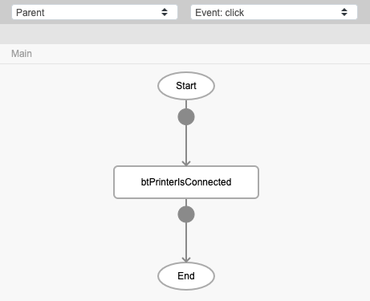
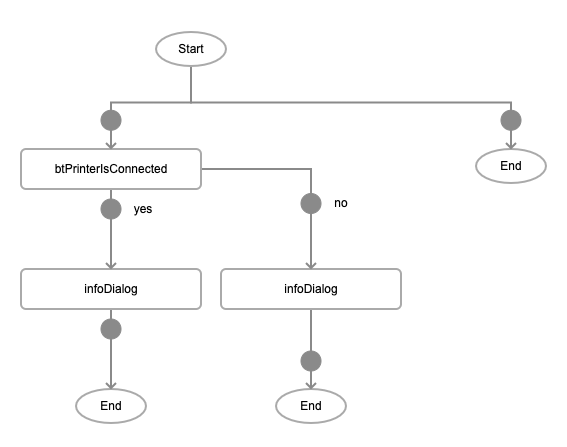
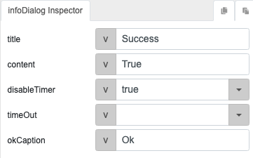
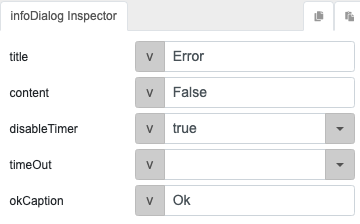
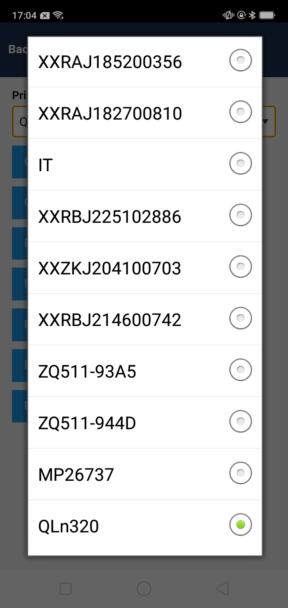
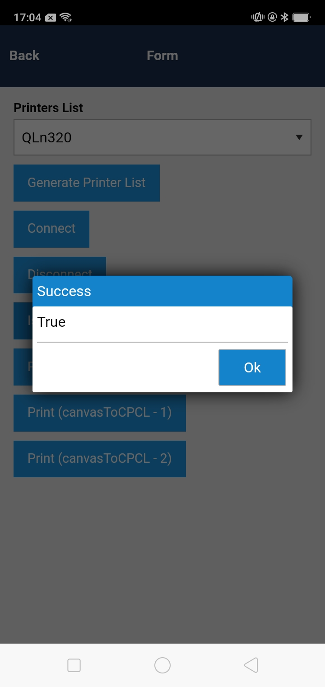

# btPrinterIsConnected

## Description

Checks whether a printer is connected to the device.

## Input / Parameter

N/A

## Output

N/A

## Callback

### yesCallback

The function to be executed if the printer is connected.

### noCallback

The function to be executed if the printer is not connected.

## Video

Coming Soon.

<!-- Format:  -->

## Example

The user wants to check whether a printer is connected to their device.

<!-- Share a scenario, like a user requirements. -->

### Steps

1. Call the function `btPrinterIsConnected` in a button component. 

    

2. Call the function `infoDialog` in the callbacks of the `btPrinterIsConnected` function.

    

    

    

<!-- Show the steps and share some screenshots.

1. .....

Format:  -->

### Result

1. Select the printer to check from the combobox. 
    
    

2. Press the Is Connected button. If the printer is connected to the device, the success infoDialog will appear. If the printer is not connected, the error dialog will appear.

    

<!-- Explain the output.

Format:  -->

## Links