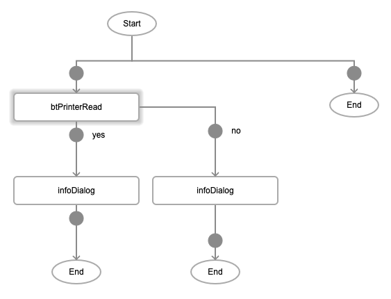
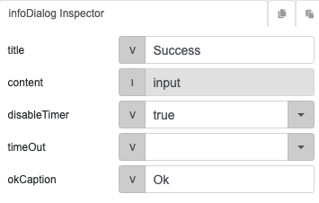
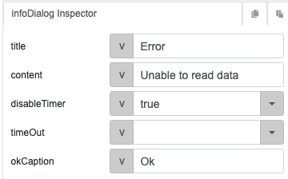

# btPrinterRead

## Description

Reads data from a bluetooth device.

## Input / Parameter

N/A

## Output

N/A

## Callback

### callback

The function to be executed if the reading of data is successful.

### errorCallback

The function to be executed if the reading of data is not successful.

## Video

Coming Soon.

<!-- Format:  -->

## Example

The user wants to read data from a bluetooth device.

<!-- Share a scenario, like a user requirements. -->

### Steps

1. Call the function `btPrinterRead`. 

    

    

    

2. Call the function `infoDialog` in the callbacks of the `btPrinterRead` function to view the status.

    

    

<!-- Show the steps and share some screenshots.

1. .....

Format:  -->

### Result
    
1. If reading the data is successful, then a success infoDialog will appear, otherwise the error infoDialog will appear.

    

<!-- Explain the output.

Format:  -->

## Links