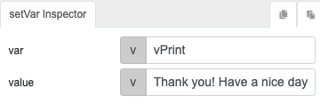
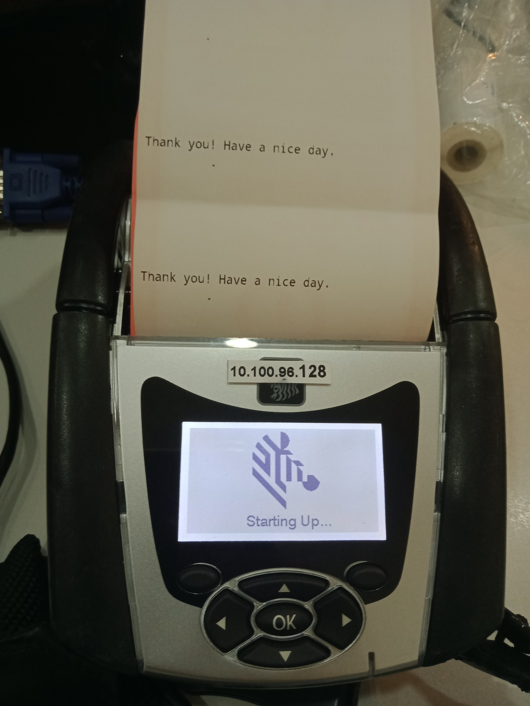

# formatToCPCL

## Description

Formats a text to CPCL printer language.

## Input / Parameter

| Name | Description | Input Type | Default | Options | Required |
| ------ | ------ | ------ | ------ | ------ | ------ |
| text | The text to print. | String/Text | - | - | Yes |

## Output

N/A

## Callback

N/A

## Video

Coming Soon.

<!-- Format:  -->

## Example

The user wants to format the text to print to CPCL printer language.

<!-- Share a scenario, like a user requirements. -->

### Steps

1. Set a variable `vPrint` using `setVar` function.

    
    
    

2. Call the function `btPrinterPrint`. Call the function `formatToCPCL` in the `text` parameter of the function to convert the text to CPCL format for printing.

    

    

<!-- Show the steps and share some screenshots.

1. .....

Format:  -->

### Result
    
1. The text formatted to CPCL will be printed.

    

<!-- Explain the output.

Format:  -->

## Links