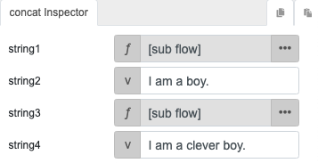
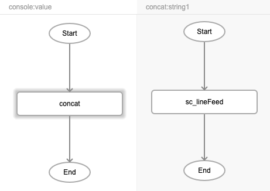

# sc_lineFeed

## Description

This function is used to signify the end of a line of text and the start of a new one. The behaviour of this function is the same as pressing the 'Enter' key. It can be used along with the concat function to return words or sentences on separate lines.

## Input / Parameter

N/A

## Output

| Description | Output Type |
| ------ | ------ |
| Returns the values passed, separated by lines between them. | Any |

## Callback

N/A

## Video

Coming Soon.

<!-- Format:  -->

## Example

The user wants to set line feed at the end of a string and start a new line.

### Step

1. Call the function `console`. Call the function `concat` inside the `value` parameter of the `console` function.
    
    

2. Call the function `sc_lineFeed` inside the `string1` and `string3` parameters of the `concat` function. Fill in the `string2` and `string4` parameters with the sentences to print.
 
    

    

### Result

 
 
## Links