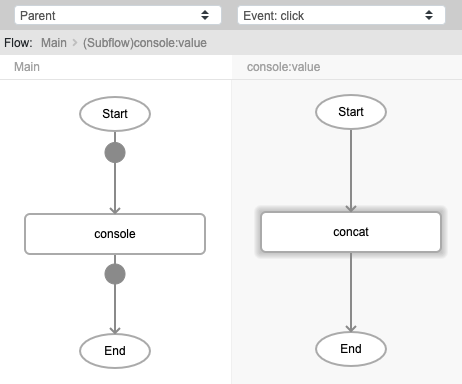
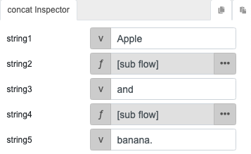
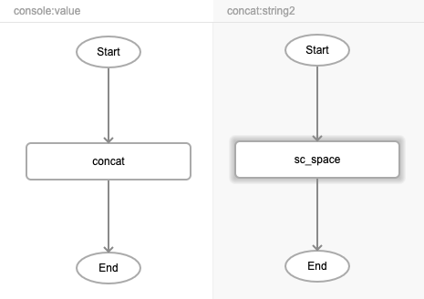

# sc_space

## Description

This function is used to add a space between the values passed. The behaviour of this function is the same as pressing the spacebar key. It can be used along with the concat function to return words or sentences with spaces between them.

## Input / Parameter

N/A

## Output

| Description | Output Type |
| ------ | ------ |
| Returns the passed values, separated by a space between them. | Any |

## Callback

N/A

## Video

Coming Soon.

<!-- Format:  -->

## Example

The user wants to add a space between the strings.

### Step

1. Call the function `console`. Call the function `concat` inside the `value` parameter of the `console` function.
    
    

2. Call the function `sc_space` inside the `string2` and `string4` parameters of the `concat` function. Fill in the `string1`, `string3` and `string5` parameters with the values to print.
 
    

    

### Result

 

## Links