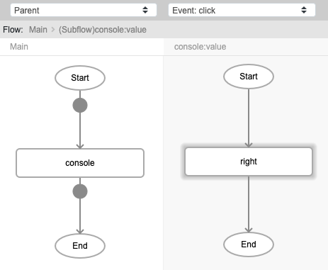
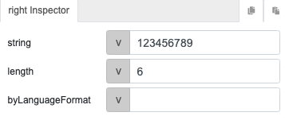
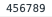

# right

## Description

Extract a specified number of characters from the right side of a text.

## Input / Parameter

| Name | Description | Input Type | Default | Options | Required |
| ------ | ------ | ------ | ------ | ------ | ------ |
| string | The value where the extraction would happen. | String/Text | - | - | Yes |
| length | The number of characters to extract. | Number | 0 | - | Yes |
| byLanguageFormat | To follow the language format. Usually this matters for languages that doesn't use alphabet. | Boolean | false | - | No |

## Output

| Description | Output Type |
| ------ | ------ |
| Returns the extracted text. | String/Text |

## Callback

N/A

## Video

Coming soon.

## Example

The user wants to display a specified number of characters from the right hand side of a string.. 

### Step

1. Call the function `console`. Call the function `right` inside the `value` parameter of the `console` function. 
    string: 123456789 
    length : 6 

   

   

### Result

## Links