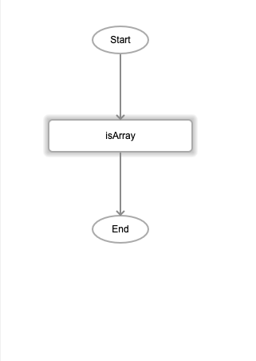
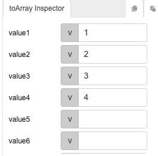
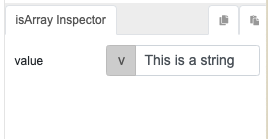

# isArray

## Description

Determines whether the passed value is an array/list.

## Input / Parameter
    
| Name | Description | Input Type | Default | Options | Required |
| ------ | ------ | ------ | ------ | ------ | ------ |
| value | The value to be checked. | Any | - | - | Yes |

## Output   

| Description | Output Type |
| ------ | ------ |
| Returns true if value is an array otherwise false. | Boolean |

## Callback

N/A

## Video

Coming soon.

## Example

### isArray: True

1. Drag the `isArray` function into the event flow. 

    

2. For value, use the function `toArray` to pass an array to the `isArray` function. 

    

    

3. `isArray` will return `true` since the value is an array. 

### isArray: False

1. Drag the `isArray` function into the event flow. 

    

2. Pass the value `This is a string` to the function.

    

3. `isArray` will return `false` since the value is a string and not an array.

## Links