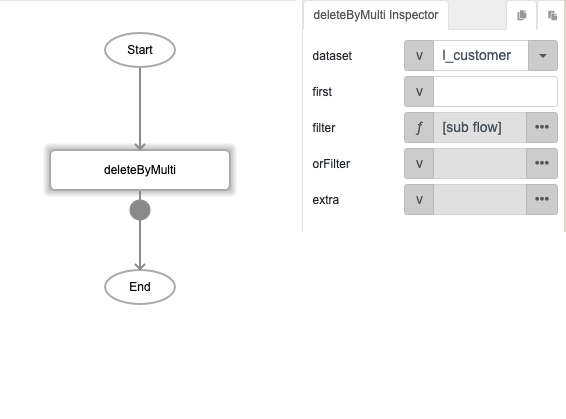
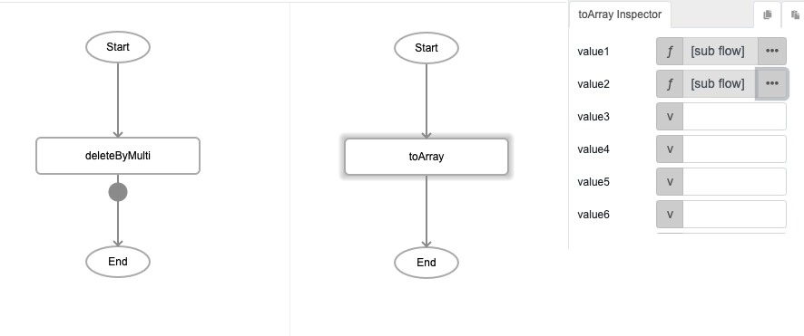
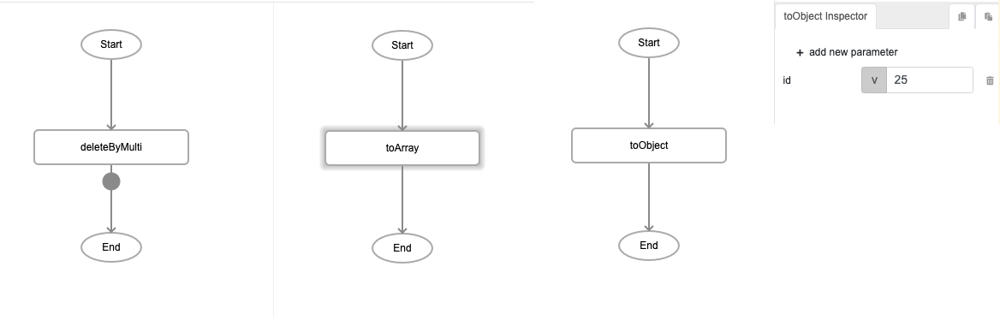
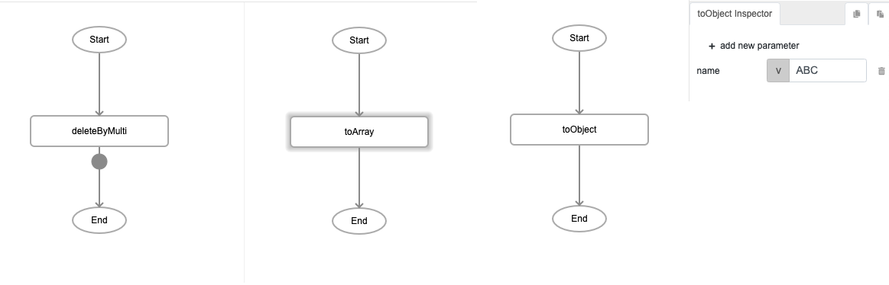
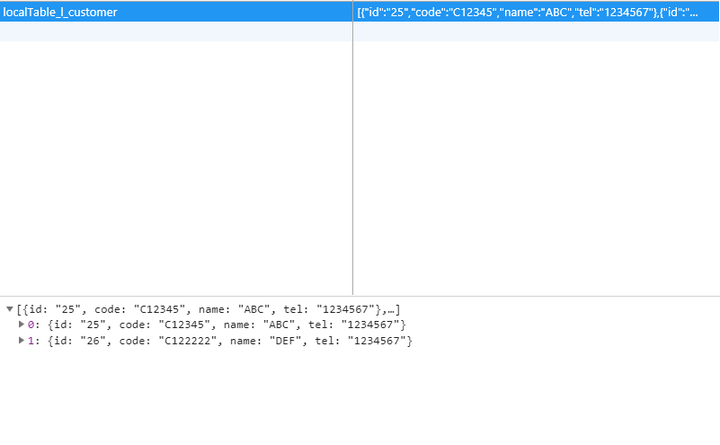
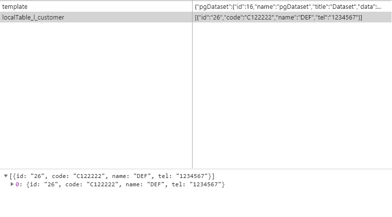

# deleteByMulti

## Description

Removes specified records from multiple fields in a dataset.

## Input / Parameter

| Name | Description | Input Type | Default | Options | Required |
| ------ | ------ | ------ | ------ | ------ | ------ |
| dataset | The name of the local table to remove the records from. | String/Text | - | - | Yes |
| first? | ? | String/Text | - | - | No |
| filter | The filters for the field and value to remove. | Array/List | - | - | Yes |
| orFilter | Additional filters for the field and value to remove. | Array/List | - | - | No |
| extra | Extra parameters stored and passed to callback. | Any | - | - | No |

## Output

| Description | Output Type |
| ------ | ------ |
| Returns the updated local table as a list. | Array/List |

## Callback?

### callback

The function to be executed if the specified records are removed successfully.

### errorCallback

The function to be executed if the specified records are not removed successfully.

## Video

Coming Soon.

<!-- Format:  -->

## Example

The user wants to delete the field id=25 and name=ABC from dataset "l_customer".

### Step

1. Call the function "deleteByMulti" and define the dataset.
    
   dataset: l_customer 

    

   
2. Set toArray and toObject function to filter and define the         value of object.
     filter: toArray --> toObject 
        id: 25 
        name: A1A2A3A4 
         
 
    
    
    
    
### Result

  
  ( Before delete, the id=25; name= A1A2A3A4 is still store in the local table. )
   
  
  ( After delete, id=25; name= A1A2A3A4 was removed in local table.)
   

## Links