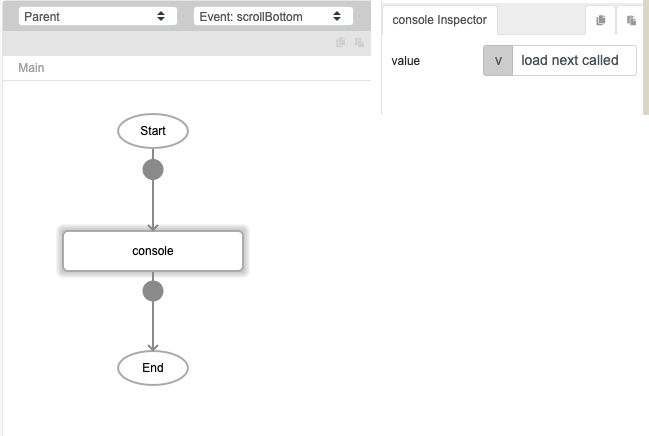
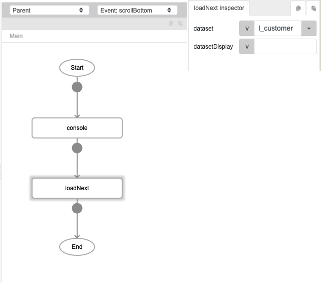
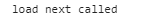
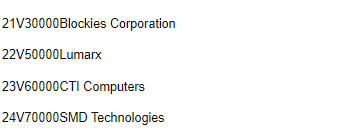

# loadNext

## Description

Loads the subsequent records in a dataset after loadData function was run.

## Input / Parameter

| Name | Description | Input Type | Default | Options | Required |
| ------ | ------ | ------ | ------ | ------ | ------ |
| dataset | The name of the local table to be loaded. | String/Text | - | - | Yes |
| datasetDisplay? | The values to displayed from the local table. | Boolean | false | true, false | No |

## Output

| Description | Output Type |
| ------ | ------ |
| Returns the list of subsequent records from the dataset. | Array/List |

## Callback?

### beforeCallback

The function to be executed if the subsequent records are loaded successfully.

## Video

Coming Soon.

<!-- Format:  -->

## Example

The user wants to load the next of the data after a specific number of the data are loaded from dataset "l_customer".

### Step

1. Add a console for display the value"load    next called".

   
 
2. Call the function "loadNext" and define     the dataset.
    dataset: l_customer
    
   

### Result

  (Add a console and set the value "load next called" just let you more clear to see the different result between load data and load next function.)

  

( When you call the function "loadNext", the rest of the data will be display it continuously. )

## Links