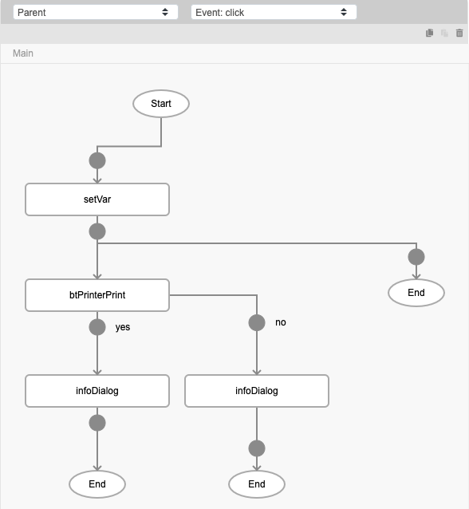
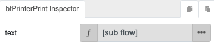
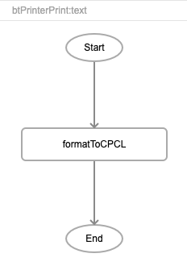
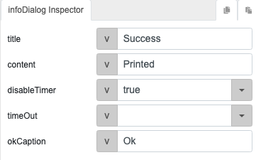
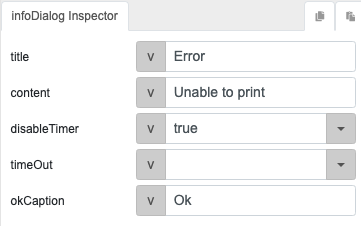
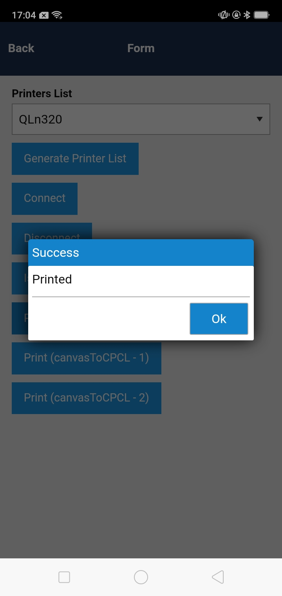

# btPrinterPrint

## Description

Sends data to a printer to print the required document.

## Input / Parameter

| Name | Description | Input Type | Default | Options | Required |
| ------ | ------ | ------ | ------ | ------ | ------ |
| text | The data to print. | String/Text | - | - | Yes |

## Output

N/A

## Callback

### callback

The function to be executed if the data to be printed is sent to the printer successfully.

### errorCallback

The function to be executed if the data to be printed is not sent to the printer successfully.

## Video

Coming Soon.

<!-- Format:  -->

## Example

The user wants to print a document from the device.

<!-- Share a scenario, like a user requirements. -->

### Steps

1. Call the function `btPrinterPrint`. Call the function `formatToCPCL` in the `text` parameter of the function to convert the text to CPCL format for printing.

    

    

    

2. Call the function `infoDialog` in the callbacks of the `btPrinterPrint` function to view the status.

    

    

<!-- Show the steps and share some screenshots.

1. .....

Format:  -->

### Result
    
1. If the document is printed successfully, the success infoDialog will appear, otherwise the error infoDialog will appear.

    

<!-- Explain the output.

Format:  -->

## Links