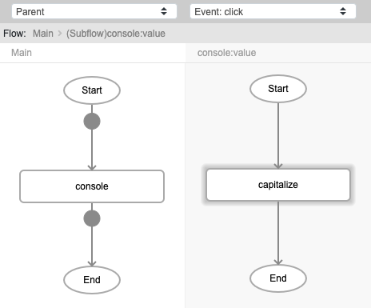
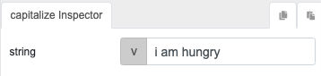
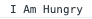

# capitalize

## Description

Converts all the first characters of the words in the passed value to upper case.

## Input / Parameter

| Name | Description | Input Type | Default | Options | Required |
| ------ | ------ | ------ | ------ | ------ | ------ |
| string | The value to be capitalized. | String/Text | - | - | Yes |

## Output

| Description | Output Type |
| ------ | ------ |
| Returns the converted value. | String/Text |

## Callback

N/A

## Video

Coming soon.

## Example

The user wants to convert all the first letters of the value passed to upper case. 

### Step

1. Call the function `console`. Call the function `capitalize` inside the `value` parameter of the `console` function.
    
    string: i am hungry 

   

   

### Result

## Links